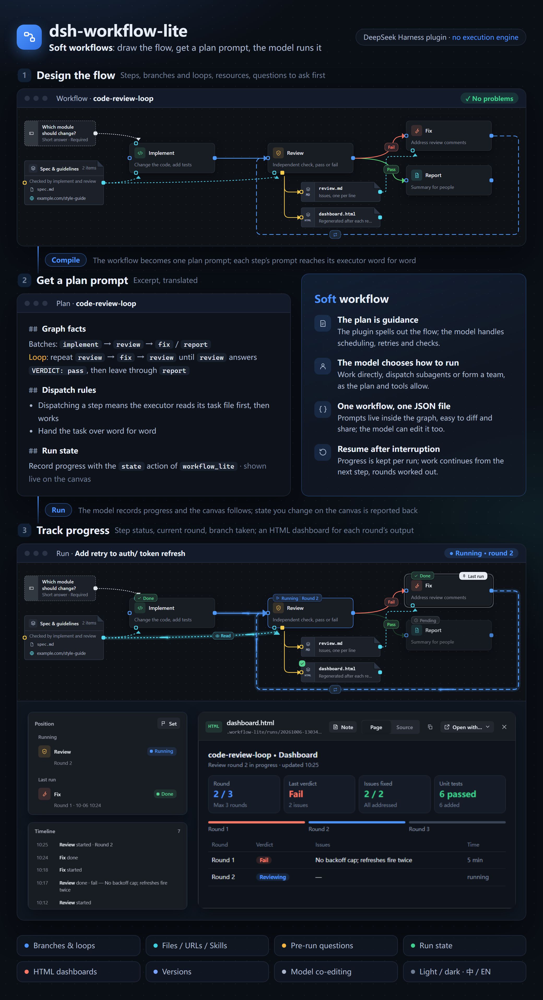

<div align="center">
  <br>
  
</div>

[简体中文](./README.md) | English

A soft-workflow plugin for [DeepSeek Harness](https://github.com/deepseek-ai/deepseek-harness): design a flow on a canvas, compile it into a plan prompt, and let the model carry it out.

> **Experimental**: features and data formats are still changing, and any release may include breaking changes.

[](https://www.npmjs.com/package/@xiaoso/dsh-workflow-lite)
[](./LICENSE)
[](https://nodejs.org)
[](https://github.com/deepseek-ai/deepseek-harness)



## Install

Works with DeepSeek Harness 0.2.0, including its preview builds (such as 0.2.0-rc.2).

### Web

Requires Node.js 22 or later.

```bash
dsh plugin --profile web add @xiaoso/dsh-workflow-lite
dsh web
```

### Desktop

1. Open **Plugins** in the sidebar, then click **Add plugin** → **Install a third-party plugin**.
2. Enter `@xiaoso/dsh-workflow-lite` and click **Install**.
3. Restart DeepSeek Harness.

Once installed, a **Workflow** tab appears at the top of the session page.

## Usage

### Ask the model

Describe the flow in one sentence in the conversation, for example:

> Create a workflow: write the code, then review it; if the review fails, go back and fix it, at most three rounds.

The model creates the workflow and the canvas shows it as it is built. When it looks right, click **Run** in the top-right corner, or ask the model to run it.

### Edit by hand

1. Open the **Workflow** tab and create a workflow.
2. Drag steps from the library on the left onto the canvas, fill in their prompts, and connect them.
3. Click **Run** in the top-right corner, or ask the model in the conversation to run the workflow.

### Follow progress

Turn on **Record run state** in **Workflow settings**. Every run then leaves a record and the canvas updates as the model works. Run records, workflows and versions are managed in the **Workflow hub**, opened from the top-left corner of the canvas.

## Features

| Feature | Description |
|---|---|
| Canvas editing | Drag steps and connect them, with pass / fail branches and loops; tidy the layout in one click |
| Resources | Attach files, folders, URLs or Skills that a step reads or writes |
| Pre-run questions | Collect the information a run needs from the user; answers are passed to the model with the plan |
| Model co-editing | The model can create and edit workflows directly, and the canvas updates live |
| Run state | Progress appears on the canvas as it happens; read each step's summary, adjust its state, and the model is notified |
| Page preview | HTML files among the resources open as pages; make one a dashboard updated every round to follow a loop's output |
| Versions | Save versions with notes, compare differences, switch back at any time |
| Workflow hub | One place for run records across sessions, all workflows and their versions, and plugin settings |
| Interface | Four light and four dark color themes that follow DSH light or dark mode; English / 中文 |

## How it works

1. **Design**: arrange steps on the canvas, write the prompt each executor receives, and describe the flow with branches and loops.
2. **Compile**: the plugin turns the workflow into one plan prompt that states the order of work, loop conditions, and each step's inputs and outputs.
3. **Run**: the model decides how to carry out the plan (working directly, dispatching subagents or forming a team) and reports progress back to the canvas.

The plugin ships no execution engine and needs no extra service; scheduling and judgement stay with the model in your current session.

## License

[MIT](./LICENSE) © xiaoso
