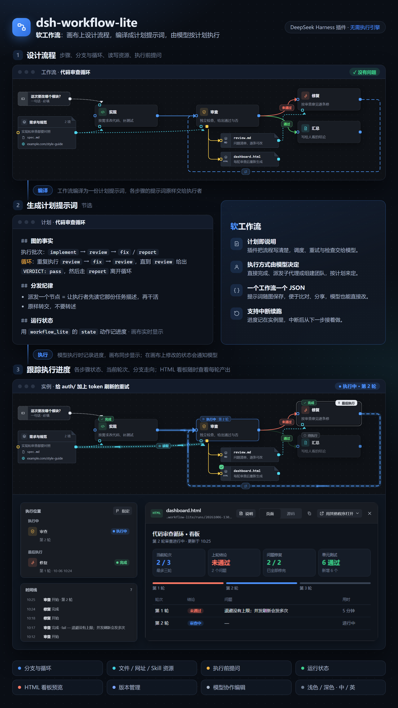

<div align="center">
  <br>
  
</div>

简体中文 | [English](./README.en.md)

[DeepSeek Harness](https://github.com/deepseek-ai/deepseek-harness) 的软工作流插件：在画布上设计流程，编译成计划提示词，由模型按计划执行。

> **实验阶段**：功能和数据格式仍在调整，后续任何版本都可能包含不兼容的改动。

[](https://www.npmjs.com/package/@xiaoso/dsh-workflow-lite)
[](./LICENSE)
[](https://nodejs.org)
[](https://github.com/deepseek-ai/deepseek-harness)



## 安装

适配 DeepSeek Harness 0.2.0，包括它的各个预览版（如 0.2.0-rc.2）。

### 网页版

需要 Node.js 22 及以上。

```bash
dsh plugin --profile web add @xiaoso/dsh-workflow-lite
dsh web
```

### 桌面端

1. 在侧边栏打开「**插件**」，点击「**添加插件**」→「**安装第三方插件**」。
2. 填入 `@xiaoso/dsh-workflow-lite`，点击「**安装**」。
3. 重启 DeepSeek Harness。

安装完成后，会话页顶部会出现「**工作流**」标签页。

## 使用

### 让模型创建

在对话中用一句话描述流程，例如：

> 建一个工作流：先写代码，再审查，审查不通过就回去修复，最多三轮。

模型会创建工作流，画布上会同步显示。检查无误后，点击右上角「**执行**」，或让模型直接执行。

### 手动编辑

1. 打开「工作流」标签页，新建一个工作流。
2. 从左侧步骤库将步骤拖到画布上，填写提示词并连线。
3. 点击右上角「**执行**」，或在对话中请模型执行该工作流。

### 跟踪进度

在「工作流设置」中开启「**记录运行状态**」，此后每次执行都会生成一条记录，画布随进度更新。执行记录、工作流与版本统一在画布左上角的「**工作流中心**」中管理。

## 功能

| 功能 | 说明 |
|---|---|
| 画布编辑 | 拖拽步骤与连线，支持「通过 / 不通过」分支和循环，一键整理布局 |
| 资源 | 为步骤指定要读写的文件、文件夹、网址或 Skill |
| 执行前提问 | 执行前向用户收集必要信息，答案随计划交给模型 |
| 模型协作编辑 | 模型可以直接创建、修改工作流，画布实时同步 |
| 运行状态 | 执行进度实时显示在画布上；可查看每一步的摘要、调整状态并通知模型 |
| 页面预览 | 资源里的 HTML 文件点开就是页面，可做成每轮更新的看板，随时查看循环产出 |
| 版本管理 | 保存版本、添加说明、对比差异、随时切换 |
| 工作流中心 | 集中管理各会话的执行记录、全部工作流与版本，以及插件设置 |
| 界面 | 浅色、深色各四套配色主题，跟随 DSH 自动切换；中文 / English |

## 工作原理

1. **设计**：在画布上编排步骤，为每一步写好交给执行者的提示词，用分支和循环描述流程。
2. **编译**：插件把工作流整理成一份计划提示词，写明执行顺序、循环条件、每一步的输入与产出。
3. **执行**：模型按计划自行安排执行方式（直接完成、派发子代理或组建团队），并把进度同步回画布。

插件本身不包含执行引擎，也无需额外服务；调度与判断交由当前会话中的模型完成。

## License

[MIT](./LICENSE) © xiaoso
